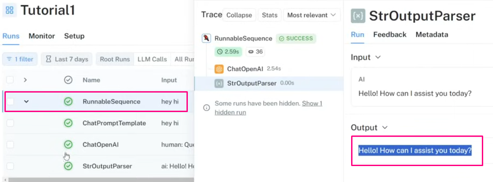

# Updated-Langchain

This End-to-end project that simplifies the lifecycle of Large Language Model (LLM) applications, including development, productionization, and deployment. The repository contains folders and files as components of the project, such as agents, APIs, chains, chatbots, GROQ (a query language), Hugging Face models, ObjectBox (an embedded database), OpenAI models, and Retrieval-Augmented Generation (RAG) models. The project aims to provide a comprehensive solution for working with LLMs, covering data handling, chatbot development, and integration with various tools and frameworks.

## Langchain Project




_____

# Construcción de un Chatbot Utilizando LLMs de Pago y de Código Abierto con Langchain y Ollama

## Visión General del Proyecto

Este proyecto demuestra la creación de un chatbot utilizando tanto modelos de lenguaje de gran escala (LLMs) de pago como de código abierto a través de Langchain y Ollama. Cubre todo el ciclo de vida de las aplicaciones LLM, incluyendo desarrollo, producción y despliegue.

## Seguridad de la información:

Si. Todas las API están secretas, con acceso de usuario restringido y anonimizadas .gitignore y otra capa de seguridad mediante Github Secret Environments (Lo siento! tendrás que utilizar las tuyas!)

## Componentes mínimos del Proyecto

- Agentes
- APIs / FastAPI
- Chains
- Chatbots
- GROQ (lenguaje de consulta)
- Modelos de Hugging Face
- ObjectBox (base de datos embebida)
- Modelos de OpenAI
- Modelos Meta Llama2 (open source)
- Modelos de Generación Aumentada por Recuperación (RAG)

## Configuración e Instalación

### 1. Configuración del Entorno

```bash
conda create -p venv python==3.10 -y
venv\Scripts\activate
pip install -r requirements.txt
```

### 2. Configuración

Configura las claves de API necesarias y las configuraciones en el archivo `app.py`.

## Uso

### 1. Ejecución del Chatbot

```bash
python app.py
```

### 2. Acceso a la Interfaz Web

Abre un navegador web y navega a (o al puerto progresivo asignado en tu computador). el mío eso:

```bash
http://localhost:8502
```
_____
### Configuremos [app.py](http://app.py) y corremos la sesión en host local

- Creamos el archivo llamando las 3 funciones principales encadenadas de nuestro chatbot base.
- Ejecutamos nuestro app.py
    
    Terminamos de configurar `app.py` y corremos
    
    )
    
    
    
- nos devuelve la ruta y abre el host en el navegador de pruebas
    
    ```bash
    Local URL: http://localhost:8502
    Network URL: http://192.168.100.30:8502
    ```
    
- Revisemos la página:
    
    
    
- Revisemos en el project en el framework de Langchain:
    
    
    
- observemos la estructura del output según la definimos:
    
    
    
- Observamos en detalle el StrOutputParser:
    
    
    
- Le consultaremos por “proveer un codigo python que intercambie dos valores” para evaluar costo, tokenizado y timepo de demora para resolver la pregunta:
- `*proveeme de un código python que swapee 2 valores.*`:
    
    
    
    ```python
    # Definir los dos valores a intercambiar
    a = 5
    b = 10
    
    print("Valores originales:")
    print("a =", a)
    print("b =", b)
    
    # Intercambiar los valores
    temp = a
    a = b
    b = temp
    
    print("\nValores intercambiados:")
    print("a =", a)
    print("b =", b)
    ```
    
- Por ultimo generamos una consulta común:
    
    “question": "Cuándo comenzar a cepillarle los dientes a los cachorros?”
    
    
    
- 

### Configuremos una versión Local con Ollama

- cargaremos ollama especificamente descargando Llama2 a nuestro computadorp ara correrlo desde mi entorno local
    - abro un cmd
        
        ```bash
        ollama run llama2
        ```
        
    - descargamos `llama2`
    
    
    
    
    
    
    
    - Consultaremos las misma última s 2 preguntas para evaluar el nivel de respuesta, coherencia y consistencia con `Llama2` en comparación con la generada con `gpt3.5 turbo`
    - Miramos las respuestas en navegador de pruebas:
    
    
    
    - Revisemos langsmith en Langchain para revisar el tracing de la consulta, latencia, tokenizados y todo el proceso.
    
    
    
    
    
    - “provide me a python code to swap 2 numbers”
    
    
    
    - como vemos el tiempo de proceso y generación de la respuesta
    - Fue muchísimo más alta, además el tokenizado se disparó rápidamente a 388 tokens.
    - El tamaño y extensión de la respuesta es generada por la pregunta, pero mucho más. Y el nivel de información y completitud también lo es, lo que supone que el modelo OpenAI Intento responder con brevedad y precisión, sin extenderse en detalles semánticos mientras que el modelo funciona.
    - Lama 2 fue mucho más verbal o verborreico y con un impacto asociado al tiempo de proceso local que depende del computador en el que esté corriendo el modelo y la inteligencia detrás de la respuesta generada por el modelo mismo.
_____
## Características

- Integración con los modelos GPT de OpenAI
- Soporte de LLM local usando Ollama (Llama2)
- Interfaz web para una fácil interacción
- Comparación de rendimiento entre LLMs basados en la nube y locales

## Comparación de Rendimiento

El proyecto incluye una comparación entre el GPT-3.5-turbo de OpenAI y el modelo Llama2 ejecutado localmente:

- Tiempo de respuesta (latencia)
- Uso de tokens
- Calidad y coherencia de las respuestas

## Monitoreo y Análisis

Utilizamos Langsmith en Langchain para monitorear:

- Trazado de consultas
- Latencia
- Uso de tokens
- Flujo general del proceso

## Contribuciones

Las contribuciones para mejorar el chatbot o extender sus capacidades son siempre bienvenidas. Por favor, envía solicitudes de extracción o abre problemas para cualquier mejora.

**#### *Quieres aprender? enviame un DM!***

## Licencia

Este proyecto es de código abierto y está disponible bajo la Licencia MIT.
